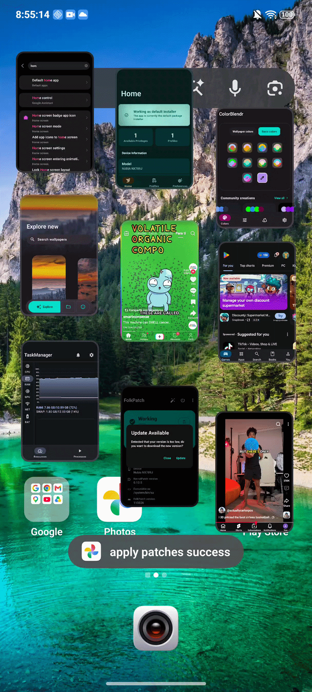

   <h1>FixRedMagicWindow</h1>
   
An Xposed module that removes the split-window (floating-window) app limits on RedMagicOS.

---

## Preview

## Requirements

- RedMagic OS (tested on my Redmagic 10 Pro (NX789J) Android 16)
- A root/Xposed framework

## What it does

Patches system-level restrictions so any app can be opened in floating/split-window mode, and removes the cap on how many windows can be open at once.

## Downloads

See the [Releases](https://github.com/Gio470/FixRedMagicWindow/releases) page for prebuilt APKs.

## License

[GNU General Public License v3.0](./LICENSE)

## Credits

https://github.com/u9521/WooBoxForRedmagicOS

## Note

I made this app for my personal use with the help of AI (I don't know how to code), I am not responsible if you bootloop or brick your device
